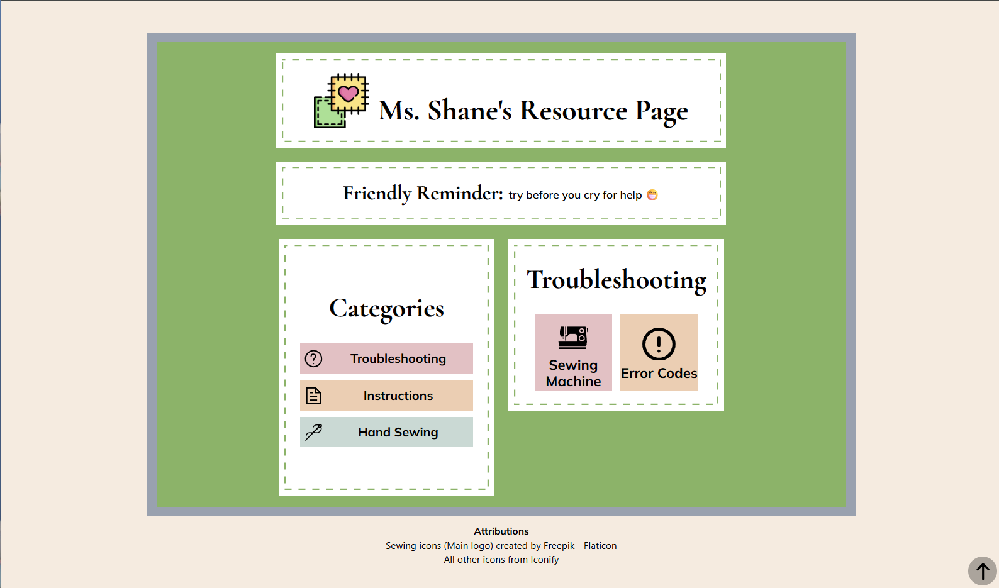
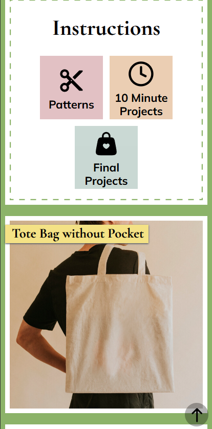

# Resource Page

A React website created for a teacher that holds a few resources for their students to refer to. Data for those resources are stored in a Google Sheet and fetched using the Google Sheets API.

### Built with:

   

- Dependencies:
  - [motion](https://motion.dev/docs/react)
  - [focus trap react](https://github.com/focus-trap/focus-trap-react)




### Deployment

https://ms-shanes-resource-page.vercel.app

## Introduction

Resource Page is a website created with the intention of getting students to find the answers to some of their questions on their own using the resources provided by their teacher. It contains clear main categories and subcategories to get them to where to they want to go (Troubleshooting, Instructions, Hand Sewing). Individual resources include YouTube videos or PDF files or both.

## Features

- **Mobile-friendly:** students will primarily be using their phones to navigate through the site, so making the site mobile-friendly was a must.
- **Back to Top:** ensures that getting back to the top of the page after scrolling through all the resources is easier.
- **External Links:** each individual resource contains links to open in a separate tab to see the YouTube video or PDF file on a bigger screen.

## Challenges

- **Problem**: How to display and access PDFs.
  - **Solution**: The PDFs have to be somewhere for it to be accessed. Moved PDFs to a separate Google Drive and put the links to them into the Google Sheet for the website to access. Permission on the PDF itself and the Google Drive must be set to 'Anyone with a link' or it won't show up.
- **Problem**: Direct links from the YouTube video and Google Drive PDF files weren't working.
  - **Solution**: They had to be a specific link style to be able to be used (https://drive.google.com/file/d/${pdfMatch}/preview or https://www.youtube.com/embed/${vidMatch?.[1]}). Since the ID of the files were the only things that changed, used match to get the ID from the old link and add it into the working link.
    ```
    const pdfMatch = currentRes.pdf.match(/\/d\/([^/]+)/)[1];
    embedPDF = `https://drive.google.com/file/d/${pdfMatch}/preview`;
    ```
- **Problem:** Default dashed border design doesn't match the dashes in Figma design
  - **Solution**: Used [Dashed Border Generator](https://kovart.github.io/dashed-border-generator/) to make the correct border and add it to the inner part of the div.

## Future Changes/Features

- **Search Bar**: To make the navigating through the site and finding resources even faster.

## Attributions

- [Sewing icons](https://www.flaticon.com/free-icon/fabric_4644840?related_id=4644935&origin=search) by Freepik - Flaticon
- All other icons by [Iconify](https://iconify.design/)
